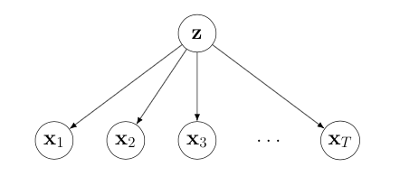

# Sequential Adaptive Mixture Importance Sampling (Sequential AMIS)

This inference routine is designed to be used on static sequential models, that
is, where one has a sequence of target distributions:

<p align="center">
  
</p>

This corresponds to a graphical model of the following form:

<p align="center">
  
</p>

This inference problem may be encountered for instance in a hierarchical model,
where variables are observed sequentially. This was the case for my work on the
multi-task dynamical system, and performing efficient inference over $z$ turned
out to be more challenging than expected (for instance, one cannot use particle
filtering, since this results only in re-weighting a single set of particles,
and assumed density filtering can be expensive when the reverse KL projection
cannot be done cheaply.

## AMIS

Calculating each posterior in the above problem uses an implementation of AMIS
(Cappé et al. 2008). This procedure iteratively improves a proposal distribution
via a sampling-reweighting-refitting loop. This channels the previous
computation through the bottleneck of a parametric form, which avoids the
re-weighting problem of using particle filtering. We use a Gaussian mixture
model (GMM, similarly to Cappé et al.) with $k$ components, where the complexity
can be easily tuned via choice of $k$.

There's not so many implementations of AMIS kicking around, and it appears to be
an effective algorithm for many problems I've tried it on; it might therefore be
of interest in its own right. For complex or high dimensional target
distributions, one may wish to consider annealing from the prior. This may be
easily accomplished using the sequential AMIS function below.

Caveat emptor: I wrote the source for this a couple of years before this
refactoring, and therefore I cannot vouch for the correctness of the code wrt
the original paper. FWIW it's unlikely that there is anything major different,
but it may differ in some small details.

The AMIS syntax is as follows (dumped from the help file:)

```julia
    amis(log_f, pis, mus, covs::AbstractArray; nepochs=5, gmm_smps=1000, IS_tilt=1., terminate=0.75, debug=false)

    amis(log_f, S, k::Int; nepochs=5, gmm_smps=1000, IS_tilt=1., terminate=0.75, debug=false)

    amis(log_f, S, W, k::Int; nepochs=5, gmm_smps=1000, IS_tilt=1., terminate=0.75, debug=false)
```

(1) `log_f`: the target function (distribution). This should take a single
argument: a set of $n \times d$ samples, and return a vector of length $n$ of
the log of the unnormalized target function (distribution) for each sample.

(2) `pis`: $k$-length probability vector of probabilities of each cluster.

(3) `mus`: matrix of cluster means: each *row* is a mean vector.

(4) `covs`: batched covariance matrices stacked in Tensor d×d×k for $k$
clusters.

Instead of args (2-4), i.e. the parameters of the GMM, one can instead supply a
matrix `S` of $n$ initial samples ($n \times d$ matrix), and optionally a
$n$-length vector `W` of log weights corresponding to each sample. In this case,
one must supply an integer $k$ (for the GMM components) as a final positional
argument.


## Sequential AMIS

The sequential AMIS routine exploits the proposal distribution learned at time
$t-1$ as the initial proposal at time $t$. This can have a useful annealing
effect. It is not especially difficult to code up this sequential procedure
using the AMIS routine above, but there are a couple of useful additions
implemented here, not least retrying AMIS with different parameters when the
effective sample size becomes too low.

The function `seq_amis`:

```julia
seq_amis(target_logfs, init_dist::Union{Distribution, Int}, k::Int; nepochs=4, IS_tilt=1.3f0,
                  gmm_smps=2000, terminate=0.6, max_retry=3, verbose=true, min_ess=min(100, gmm_smps/2))
```

takes a vector (or other iterable) of target log densities (these may be unnormalized, as above), an initial distribution (one can supply simply the dimension of the problem to use the default of a standard multivariate Gaussian), and the number of GMM components, $k$.

A simple example, using Gaussian targets (from the test script) is:

```julia
n_targets = 8
true_pars = [(zeros(2) .+ i, Float64[1 0; 0 1] ./ i) for i in 1:n_targets];
seq_targets = [x->logpdf(MvNormal(μ, Σ), x') for (μ, Σ) in true_pars]

seq_smps, seq_gmms = seq_amis(seq_targets, 2, 3)
```
